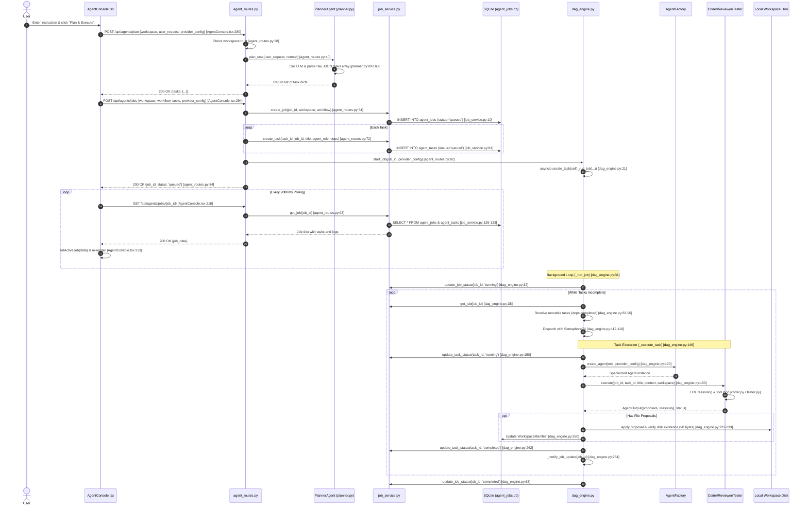
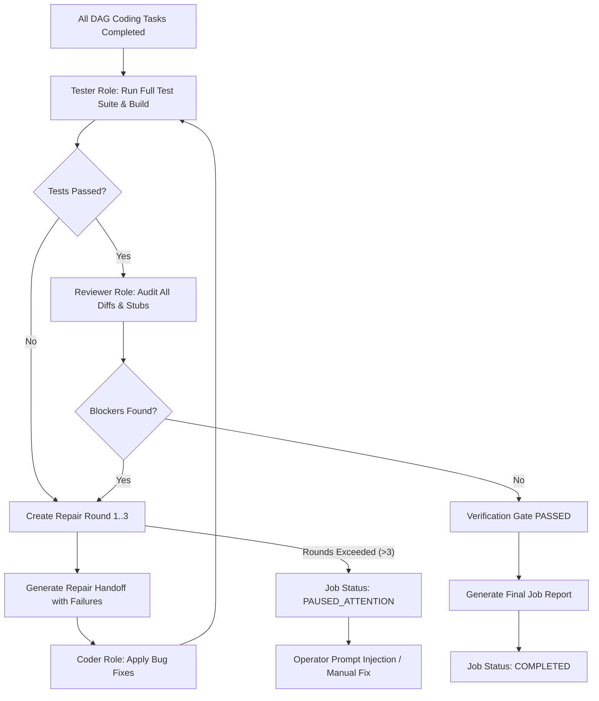

# CODE OS v4.0.0 — Multi-Agent Team Mode Console Audit & Architecture Plan
**Document Version:** 4.0.0-AUDIT  
**Date:** September 2026  
**Scope:** AI Agent Console Deep-Dive Audit & Architectural Blueprint  
**Status:** Read-Only Audit & Design Specification (No Application Code Changes)

---

## Executive Summary & Protected Files Confirmation

The Rony Chat Harness (`chat_harness.py` and `app/features/ai/harness/*`) is Codex-class, feature-complete, and **FROZEN**. 

The **AI Agent Console** will serve as the dedicated powerhouse for multi-agent autonomous engineering on medium-to-large software projects. To guarantee zero regressions in the primary chat experience, the Multi-Agent Team Mode will be developed with strict boundary isolation.

### 🛡️ Protected Files Guarantee
The following files and packages are **STRICTLY PROTECTED** and will **NEVER be modified** in any phase:
- `backend/app/features/ai/chat_harness.py`
- `backend/app/features/ai/harness/*` (`plan_parser.py`, `tool_executor.py`, `sse_streamer.py`, `stage_finalizer.py`, `approval_coordinator.py`, `context_assembler.py`, `prompt_builder.py`, `checkpoint_manager.py`, `compaction_manager.py`, and all related modules)
- `backend/app/features/ai/providers/*`
- `backend/app/features/ai/sandbox/executor.py`
- `src/features/ai/AIChatPanel.tsx`
- `src/stores/aiStore.ts` (chat streaming logic)

All team execution logic will exist in dedicated, decoupled packages and components, extending shared persistence services (`database.py`, `job_service.py`, `step_tracker.py`, `agent_routes.py`) **strictly additively**.

---

## Exact File Modification Roster

### New Files to Create
1. `backend/app/features/ai/team/__init__.py`
2. `backend/app/features/ai/team/orchestrator.py` — Multi-agent DAG scheduler, concurrency manager, and verification loop
3. `backend/app/features/ai/team/roles.py` — Concrete role implementations: `ArchitectRole`, `CoderRole`, `ReviewerRole`, `TesterRole`, `DevOpsRole`
4. `backend/app/features/ai/team/handoff.py` — Structured artifact protocol passing files, AST summaries, test results, and review remarks between agents
5. `backend/app/features/ai/team/team_routes.py` — Dedicated endpoints for team workflow submission, SSE event streaming, mid-run user prompt injection, and pause/resume
6. `backend/app/features/ai/team/team_schemas.py` — Pydantic models for team configs, structured messages, handoffs, and SSE events
7. `backend/tests/test_team_orchestrator.py` — Headless and integration test suite for team execution, repair loops, and role enforcement
8. `src/features/ai/console/TeamConsole.tsx` — Root container for Multi-Agent Team Mode
9. `src/features/ai/console/DAGBoard.tsx` — Interactive 2D DAG visualizer and execution progress board
10. `src/features/ai/console/TeamChatPanel.tsx` — Real-time team chatter feed, decision log, handoff viewer, and operator prompt injection
11. `src/features/ai/console/AgentRoster.tsx` — Agent team roster with model pickers, live role statuses, and token/cost counters
12. `src/features/ai/console/teamStore.ts` — Zustand store managing team DAG state, live SSE stream updates, and operator actions
13. `src/__tests__/team_console.test.tsx` — Vitest component and store test suite
14. `docs/TEAM_CONSOLE_AUDIT.md` — This architecture and audit specification

### Existing Files to Extend (Strictly Additive)
1. `backend/app/db/database.py` — Register **Migration 7** creating `team_messages` and `team_configs` tables and extending job status triggers
2. `backend/app/features/ai/job_service.py` — Add helper functions: `add_team_message()`, `get_team_messages()`, `record_agent_token_usage()`, `get_agent_metrics()`
3. `backend/app/features/ai/step_tracker.py` — Add atomic step lifecycle hooks for multi-agent DAG task step durability
4. `backend/app/features/ai/agent_routes.py` — Mount `team_routes` router under `/team` or include additive endpoints
5. `src/features/ai/AgentConsole.tsx` — Add mode switch toggle ("Standard Workflow" vs "Team Mode") to host `TeamConsole`

---

## A1. Current State Inventory

| Component / File | Status | What Works Today | What Is Wired to UI | What Is Missing / Orphaned |
| :--- | :--- | :--- | :--- | :--- |
| **`src/features/ai/AgentConsole.tsx`** | **PARTIAL** | Basic prompt intake; provider & model selectors; task planning launch; 2s HTTP polling; simple vertical step list; live terminal log container with regex token extraction; action approval cards (approve/reject/recover/answer). | Fully wired to `/api/agents/plan`, `/api/agents/jobs`, `/cancel`, `/approve`, `/reject`, `/recover`, `/answer`. | No real 2D DAG graph (rendered as a linear vertical list); no team chat or agent-to-agent chatter; no per-agent model roster; no handoffs; no SSE streaming (relies entirely on 2s interval polling); all state stored in local React `useState`. |
| **`backend/app/features/ai/agent_routes.py`** | **WORKING** | Endpoints for `/plan`, `/jobs`, `/jobs/{id}`, `/cancel`, `/approve`, `/reject`, `/recover`, `/answer`, `/audit`, `/coder-mode/execute`, `/interrupted`, `/{id}/resume`. | Fully wired to `AgentConsole.tsx` and `CodeVerifierPanel.tsx`. | No team endpoints; no SSE event stream for jobs; permission handling uses in-memory global dicts (`permission_state.py`) that lack requesting-agent role attribution. |
| **`backend/app/features/ai/job_service.py`** | **WORKING** | CRUD operations on SQLite `agent_jobs` and `agent_tasks`: `create_job`, `update_job_status`, `add_job_log`, `create_task`, `update_task_status`, `get_job`, `list_jobs`, `pause_job`, `resume_job`, `get_job_manifest`, `update_job_manifest`. | Polled via `get_job` and `list_jobs` from `agent_routes.py`. | Token tracking is a single scalar (`token_usage`) for the entire job; logs are flat strings; no per-agent token/cost breakdown; no structured team messages table. |
| **`backend/app/features/ai/dag_engine.py`** | **WORKING** | In-memory DAG loop; dependency resolution (`completed_task_ids`); concurrency limiting via `asyncio.Semaphore(3)`; deadlock detection; spec coverage analysis; edit proposal creation & disk application with zero-byte checks. | Runs jobs started by `AgentConsole.tsx`. | **Orphaned step tracking**: never writes to `task_steps` in `step_tracker.py`; no verification gate (Tester pass + Reviewer signoff); no automated repair loop between Coder and Tester; no structured handoffs between roles. |
| **`backend/app/features/ai/agents/base.py`** | **WORKING** | Abstract interface compatibility wrapper; streaming chat request handler; intra-provider fallback for Groq rate limits. | Used as fallback for unmigrated agent roles. | Legacy implementation; monolithic prompt execution. |
| **`backend/app/features/ai/agents/coder.py`** | **WORKING** | 1435-line comprehensive implementation with plan/hypothesis/code/review/test stages; multi-tool iterative execution; stub code detection; git diff creation. | Executed by `dag_engine.py` for `'Coding Agent'` tasks. | Monolithic: collapses planning, coding, reviewing, and testing into a single agent rather than a true multi-agent team. |
| **`backend/app/features/ai/agents/reviewer.py`** | **WORKING** | Code review agent using `read_file`, `list_directory`, `search_code`; returns structured JSON with issue severity, category, and approval verdict. | Instantiated by `AgentFactory` when assigned `'Review Agent'`. | Operates in isolation; cannot reject a PR back to a Coder with actionable repair instructions in an automated loop. |
| **`backend/app/features/ai/agents/tester.py`** | **WORKING** | Test runner detection (`pytest`, `jest`, etc.); test suite execution and test generation using `agent_tools.py`. | Instantiated by `AgentFactory` when assigned `'Testing Agent'`. | Cannot gate job completion; test failures do not trigger an autonomous repair loop with the Coder. |
| **`backend/app/features/ai/agents/agent_tools.py`** | **WORKING** | Safe workspace tools: `read_file`, `list_directory`, `search_code`, `run_test`. Path traversal protection via `ensure_within_workspace`. | Invoked by specialized agents during execution. | Missing git diff, commit inspection, and system command capabilities needed by DevOps and Reviewer roles. |
| **`backend/app/features/ai/agents/agent_interface.py`** | **WORKING** | Abstract `BaseAgent` class and `AgentOutput` Pydantic model; standardized `create_chat_request` and `request_permission`. | Foundation for all specialized agents. | Lacks structured handoff context inputs and team event emitting capabilities. |
| **`backend/app/features/ai/step_tracker.py`** | **WORKING / ORPHANED** | High-performance write-ahead logging to `task_steps` SQLite table: `log_step_pending`, `mark_step_running`, `mark_step_completed`, `mark_step_failed`, crash recovery discovery (`recover_interrupted_tasks`). | Only queried by `/api/agents/interrupted` and `aiStore.ts`. | **Completely orphaned by `dag_engine.py`**: `dag_engine` does not record step milestones to `task_steps`, preventing step-level resumption. |
| **Frontend Job Store (`teamStore` / `agentProgressState`)** | **ABSENT** | N/A | None. | Zero state persistence across navigation; `AgentConsole.tsx` loses state if unmounted; no Zustand store for team execution. |

---

## A2. Job Lifecycle Trace (Hop-by-Hop)

Below is the complete execution path of a job in the current codebase from intake to completion:



### The Clean Seam for Team Mode
The exact architectural seam where the multi-agent team orchestrator connects without touching `chat_harness.py`:
1. **Intake & Dispatch Seam (`agent_routes.py` / `team_routes.py`)**: 
   - Currently, `POST /api/agents/jobs` delegates directly to `dag_engine.start_job(job_id)`.
   - By creating `POST /api/team/jobs`, the request bypasses legacy `dag_engine.py` and hands off execution to `TeamOrchestrator.start_team_job(job_id, team_config)`.
2. **Durability Seam (`step_tracker.py`)**:
   - `TeamOrchestrator` wraps every step in `step_tracker.log_step_pending()` and `step_tracker.mark_step_completed()`.
   - In the event of a process interruption, the job resumes from the last completed atomic step.
3. **Event Streaming Seam (`team_routes.py`)**:
   - Instead of 2-second HTTP polling, `team_routes.py` exposes `GET /api/team/jobs/{id}/events` via Server-Sent Events (SSE), emitting namespaced `event: team_*` payloads directly to `teamStore.ts`.

---

## A3. Gap Table: Current vs Target Vision

| # | Vision Item | Today (Current State) | Gap | Proposed Module |
| :---: | :--- | :--- | :--- | :--- |
| **1** | **Separate Intake** | `AgentConsole.tsx` has a basic text input and provider dropdown. | No spec decomposition, no file attachment support, no multi-agent team config (all tasks use one global model). | `src/features/ai/console/TeamConsole.tsx`<br>`backend/app/features/ai/team/team_schemas.py` |
| **2** | **Planning (Architect Agent)** | `PlannerAgent` (`planner.py`) runs a single LLM call with a static prompt and context summary. | Does not explore the workspace using tools; cannot inspect real files or dependencies before creating the plan. | `backend/app/features/ai/team/roles.py` (`ArchitectRole`) |
| **3** | **Execution & Concurrency** | `dag_engine.py` uses `asyncio.Semaphore(3)`. Roles are loosely typed strings. | No role specialization contracts; tasks cannot dynamically branch or trigger conditional rework. | `backend/app/features/ai/team/orchestrator.py` |
| **4** | **Team Chat & Injection** | Flat string array in `agent_jobs.logs`. Logs stream to a raw terminal container. | No agent-to-agent chatter; no structured messages; operator cannot inject steering messages mid-run. | `backend/app/features/ai/team/team_routes.py`<br>`src/features/ai/console/TeamChatPanel.tsx` |
| **5** | **Structured Handoffs** | `WorkspaceManifest` records file exports as loose JSON text. | No formalized handoff protocol between agents (e.g. Coder -> Reviewer passing diffs, Tester -> Coder passing stack traces). | `backend/app/features/ai/team/handoff.py` |
| **6** | **Approval Tagging** | `permission_state.py` holds ephemeral in-memory `asyncio.Event`s without role attribution. | Approvals are not tagged with the requesting agent role; cannot inspect agent rationale or diff in context. | `approval_coordinator.py` reuse with `agent_role` metadata payload |
| **7** | **Verification Gate & Repair** | Job completes when all tasks finish (`dag_engine.py:49`). Spec coverage check is advisory only. | No hard verification gate. Tests can fail or stubs can exist without blocking completion; no automated repair loop. | `backend/app/features/ai/team/orchestrator.py` (`VerificationGate`) |
| **8** | **Resilience & Resumption** | `step_tracker.py` exists but is completely orphaned by `dag_engine.py`. | A backend crash leaves running tasks in an indeterminate state; cannot resume a DAG from the last successful step. | `backend/app/features/ai/step_tracker.py` integration in `TeamOrchestrator` |
| **9** | **Observability & Timing** | Scalar `token_usage` integer on `agent_jobs`. Timings are only calculated at job-level (`duration`). | No per-agent token breakdown; no per-step execution timings; no cost estimation per model/role. | `team_messages` & `agent_tasks.structured_data` cost tracking |
| **10**| **Controls & Roster Config** | Job-level Cancel button. Only global provider/model selectors. | Cannot pause/resume single agents or steps; cannot configure different models for Architect vs Coder vs Reviewer. | `src/features/ai/console/AgentRoster.tsx`<br>`team_configs` table |
| **11**| **Final Report** | Flat log summary and modified files list. | No structured breakdown of files changed, tests executed, review signoffs, and total costs. | `TeamOrchestrator.generate_final_report()` |

---

## A4. Architecture Proposal

### 1. New Backend Package: `app/features/ai/team/`
```
backend/app/features/ai/team/
├── __init__.py
├── orchestrator.py      # Core DAG engine with concurrency, verification gate, & repair loop
├── roles.py             # Architect, Coder, Reviewer, Tester, DevOps agent implementations
├── handoff.py           # Structured artifact protocol (HandoffArtifact, HandoffType)
├── team_routes.py       # REST + SSE endpoints for team jobs, streaming, and operator injection
└── team_schemas.py      # Pydantic schemas for TeamConfig, TeamMessage, Handoff, and SSE events
```

### 2. Database Migration 7 Schema
To be registered in `backend/app/db/database.py` under `_run_migrations(db)`:

```sql
-- Migration 7: Multi-Agent Team Mode Console Tables
CREATE TABLE IF NOT EXISTS team_configs (
    id TEXT PRIMARY KEY,
    workspace TEXT NOT NULL,
    name TEXT NOT NULL DEFAULT 'Default Team',
    architect_model TEXT NOT NULL DEFAULT 'gpt-4o',
    architect_provider TEXT NOT NULL DEFAULT 'openai',
    coder_model TEXT NOT NULL DEFAULT 'claude-3-5-sonnet-latest',
    coder_provider TEXT NOT NULL DEFAULT 'anthropic',
    reviewer_model TEXT NOT NULL DEFAULT 'gpt-4o',
    reviewer_provider TEXT NOT NULL DEFAULT 'openai',
    tester_model TEXT NOT NULL DEFAULT 'llama-3.3-70b-versatile',
    tester_provider TEXT NOT NULL DEFAULT 'groq',
    devops_model TEXT NOT NULL DEFAULT 'llama-3.1-8b-instant',
    devops_provider TEXT NOT NULL DEFAULT 'groq',
    max_repair_rounds INTEGER NOT NULL DEFAULT 3,
    max_concurrency INTEGER NOT NULL DEFAULT 3,
    auto_verify INTEGER NOT NULL DEFAULT 1,
    created_at TEXT NOT NULL DEFAULT CURRENT_TIMESTAMP,
    updated_at TEXT NOT NULL DEFAULT CURRENT_TIMESTAMP,
    FOREIGN KEY (workspace) REFERENCES workspaces(path) ON DELETE CASCADE
);
CREATE INDEX IF NOT EXISTS idx_team_configs_workspace ON team_configs(workspace);

CREATE TABLE IF NOT EXISTS team_messages (
    id INTEGER PRIMARY KEY AUTOINCREMENT,
    job_id TEXT NOT NULL,
    task_id TEXT,
    sender_role TEXT NOT NULL,          -- 'architect' | 'coder' | 'reviewer' | 'tester' | 'devops' | 'operator' | 'system'
    recipient_role TEXT NOT NULL,       -- 'all' | role_name
    message_type TEXT NOT NULL,         -- 'chat' | 'handoff' | 'decision' | 'review_verdict' | 'test_report' | 'injection'
    content TEXT NOT NULL,
    artifact_json TEXT DEFAULT NULL,    -- Structured Handoff payload (diff, test output, AST)
    token_usage INTEGER DEFAULT 0,
    cost_usd REAL DEFAULT 0.0,
    timestamp REAL NOT NULL,
    FOREIGN KEY (job_id) REFERENCES agent_jobs(id) ON DELETE CASCADE
);
CREATE INDEX IF NOT EXISTS idx_team_messages_job ON team_messages(job_id, timestamp);
CREATE INDEX IF NOT EXISTS idx_team_messages_sender ON team_messages(sender_role);
```
*Note: Durability reuses existing `task_steps` from `step_tracker.py`, and job lifecycle reuses `agent_jobs` and `agent_tasks`.*

### 3. Frontend Architecture: `src/features/ai/console/`
```
src/features/ai/console/
├── TeamConsole.tsx      # Main layout hosting Intake, DAGBoard, TeamChatPanel, and AgentRoster
├── DAGBoard.tsx         # Visual interactive DAG graph (nodes: tasks, edges: dependencies)
├── TeamChatPanel.tsx    # Live agent-to-agent chatter, decision cards, and operator injection input
├── AgentRoster.tsx      # Team member cards with per-agent model selectors, badges, and token counters
└── teamStore.ts         # Zustand store managing team state, SSE subscription, and actions
```

#### Namespaced SSE Events (`event: team_*`)
All events streamed from `GET /api/team/jobs/{id}/events` use distinct event names:
- `team_status`: Overall job state changes (`planning`, `executing`, `verifying`, `repairing`, `completed`, `paused`, `failed`)
- `team_step_update`: Individual task state changes (`queued`, `running`, `completed`, `failed`) with timings
- `team_message`: Agent chatter, decision notes, and user injection logs
- `team_handoff`: Formal artifact transfer between roles (e.g. Coder -> Reviewer)
- `team_approval`: Dangerous action approval requested (tagged with `agent_role`)
- `team_repair`: Verification failure triggering autonomous repair round (round X of 3)
- `team_metrics`: Real-time token usage and USD cost counters per agent

### 4. Role-to-Tool Permission Mapping
Agents are granted strictly scoped tools to enforce separation of concerns and prevent privilege escalation:

| Role | Permitted Tools | Disallowed Tools | Rationale |
| :--- | :--- | :--- | :--- |
| **Architect** | `read_file`, `list_directory`, `search_code` | `edit_file`, `run_command`, `run_test` | Read-only workspace inspection. Cannot modify files or execute shell commands. |
| **Coder** | `read_file`, `list_directory`, `search_code`, `edit_file`, `run_test` | Arbitrary `run_command` | May create/edit files and run targeted unit tests. Shell commands require approval. |
| **Reviewer** | `read_file`, `list_directory`, `search_code`, `git_diff`, `git_log` | `edit_file`, `run_command` | Audits code changes and diffs. Strictly read-only; cannot modify code directly. |
| **Tester** | `read_file`, `list_directory`, `run_test`, `edit_file` (test files only: `tests/**`, `*.test.*`) | Modifying production source code | Generates and runs unit/integration tests; analyzes test failure outputs. |
| **DevOps** | `read_file`, `list_directory`, `run_command` (allowlisted: `git status`, `npm run build`, `pytest`) | Unrestricted edit of business logic | Verifies builds, checks dependencies, manages deployment configurations. |

### 5. Approval Tagging Plan via `approval_coordinator`
`approval_coordinator.py` in `backend/app/features/ai/harness/` will **NOT be modified**. Instead, the team orchestrator calls its public API:
```python
await request_approval(
    action_id=action_id,
    action_type="command",  # or "edit"
    detail=command_str,
    reason=f"[{agent_role.upper()}] {action_reason}",
    task_id=task_id,
    workspace=workspace,
    payload={
        "agent_role": agent_role,
        "job_id": job_id,
        "team_mode": True,
        "risk_level": "high" if is_destructive else "medium",
    }
)
```
The UI displays the badge of the specific agent (e.g., `[DevOps Agent]` or `[Coder Agent]`) that requested authorization.

### 6. Verification Gate & Repair Loop Architecture
A job cannot transition to `completed` merely because all tasks finished. It must pass through the **Verification Gate**:



### 7. Cost & Token Tracking Plan
1. Every LLM response token stream in `TeamOrchestrator` captures input and output tokens.
2. Standard token pricing tables (per million tokens) will estimate cost:
   - GPT-4o: \$2.50 / 1M in, \$10.00 / 1M out
   - Claude 3.5 Sonnet: \$3.00 / 1M in, \$15.00 / 1M out
   - Groq Llama-3.3-70b: \$0.59 / 1M in, \$0.79 / 1M out
   - Local / Ollama: \$0.00
3. Stored in `team_messages.token_usage` and `team_messages.cost_usd`.
4. Dynamically aggregated by `job_service.get_agent_metrics(job_id)` to display live cost per role in `AgentRoster.tsx`.

---

## A5. Risk Register (Top 5 Architectural Risks & Mitigations)

### Risk 1: Shared-State & Database Lock Contention with Chat Harness
- **Impact:** High. The Chat Harness and Team Console both access `code_os.db` via `app.db.database`. High write volume from parallel agent steps could trigger SQLite `SQLITE_BUSY` or lock timeouts.
- **Mitigation:** CODE OS utilizes a `ConnectionPool` with dedicated reader connections and a synchronized write lock in WAL mode (`database.py`). All team table writes must execute via `pool.write_execute()` with short transactions. Never hold SQLite transactions open across LLM streaming calls.

### Risk 2: Provider Rate-Limit Cascades with Parallel Agent Calls
- **Impact:** High. Concurrently executing Architect, Coder, and Tester tasks hitting the same cloud provider (e.g., Groq or OpenAI) can trigger 429 rate limits, halting the entire team.
- **Mitigation:**
  1. Strict concurrency cap via `asyncio.Semaphore(3)`.
  2. Diverse default model allocation (e.g. Architect on OpenAI, Coder on Anthropic, Tester on Groq).
  3. Automatic per-role failover models defined in `TeamConfig`.
  4. Automatic backoff pause (`pause_job(job_id, reason, retry_after)`) rather than crash.

### Risk 3: Windows Process & Subprocess Concurrency Limits
- **Impact:** Medium. Spawning multiple simultaneous test runners (`pytest`, `npm test`) or build processes on Windows can exhaust file handles, trigger antivirus file locking, or cause port collisions.
- **Mitigation:**
  1. Subprocess executions (Tester and DevOps) serialize through a dedicated test lock per workspace (`asyncio.Lock()`).
  2. All child process PIDs are registered with `track_spawned_process()` for clean teardown.
  3. Ephemeral port allocation dynamically verifies socket availability (`verifier.py:_find_free_port()`).

### Risk 4: Approval Flow Deadlocks in Headless or Background Execution
- **Impact:** Medium. If an agent step requests an approval card while the user is looking at another tab or the editor, the DAG engine could hang indefinitely.
- **Mitigation:**
  1. Add configurable timeouts (`APPROVAL_TIMEOUT_SECONDS = 300`).
  2. On timeout, transition task to `waiting` without killing the job.
  3. Surface global notification badge on the Agent Console tab icon in the left dock when an approval is pending.

### Risk 5: SSE Stream Disconnection & State Desynchronization
- **Impact:** Medium. Network drops or page reloads could cause the frontend to lose in-flight agent chatter or step transitions.
- **Mitigation:**
  1. Durable message persistence in `team_messages`.
  2. On SSE connect, `team_routes.py` sends an initial snapshot (`team_snapshot`) containing all past messages and current task states for the job.
  3. `teamStore.ts` uses idempotent message appending keyed by `message_id`.

---

## A6. Phased Build Plan (Target Implementation Roadmap)

```
Phase B1: Headless Team Orchestrator + Roles + DAG Engine (Backend Core)
    └── B1.1 team_schemas.py & handoff.py definitions
    └── B1.2 roles.py (Architect, Coder, Reviewer, Tester, DevOps)
    └── B1.3 orchestrator.py (bounded parallel execution, step_tracker integration)
    └── Acceptance: Headless pytest test_team_orchestrator passes multi-step DAG

Phase B2: Persistence & SSE Streaming Endpoints (Backend API)
    └── B2.1 Migration 7 (team_configs, team_messages) in database.py
    └── B2.2 job_service.py extensions for team messaging & per-agent metrics
    └── B2.3 team_routes.py (/jobs, /events SSE stream, /inject)
    └── Acceptance: Live SSE client receives typed team events in real-time

Phase B3: Frontend Core — DAG Board, Team Console & Roster
    └── B3.1 teamStore.ts (SSE consumer, DAG node/edge state, active job state)
    └── B3.2 AgentRoster.tsx (role cards, per-agent model pickers, token counters)
    └── B3.3 DAGBoard.tsx (visual DAG with status badges, timings, dependencies)
    └── B3.4 Mount TeamConsole in AgentConsole.tsx with mode switch toggle
    └── Acceptance: Frontend renders multi-agent DAG board updating via live SSE

Phase B4: Live Team Chat & Operator Mid-Run Injection
    └── B4.1 TeamChatPanel.tsx (real-time chatter feed, decision cards, handoff viewer)
    └── B4.2 Operator injection input box (sends instructions to specific agent or team)
    └── B4.3 Handoff inspector modal (inspect file diffs, test outputs, review notes)
    └── Acceptance: Operator injects instruction during active run; agent responds in chat

Phase B5: Autonomous Verification Gate & Repair Loop
    └── B5.1 VerificationGate implementation in orchestrator.py
    └── B5.2 Automated handoff from Tester/Reviewer failure -> Coder repair
    └── B5.3 Repair round counter (max 3 rounds) with visual repair badges
    └── Acceptance: Injected failing test triggers autonomous Coder repair; succeeds on round 2

Phase B6: Approval Tagging, Observability & Final Job Report
    └── B6.1 Approval request role tagging via approval_coordinator reuse
    └── B6.2 Per-agent token & USD cost calculation in teamStore
    └── B6.3 Final Report card (files modified, tests executed, review remarks, total cost)
    └── Acceptance: Full test suite green across backend & frontend with zero protected file edits
```

---

## Zero Protected Files Confirmation
- `backend/app/features/ai/chat_harness.py` -> **0 modifications**
- `backend/app/features/ai/harness/*` -> **0 modifications**
- `backend/app/features/ai/providers/*` -> **0 modifications**
- `backend/app/features/ai/sandbox/executor.py` -> **0 modifications**
- `src/features/ai/AIChatPanel.tsx` -> **0 modifications**
- `src/stores/aiStore.ts` -> **0 modifications**
