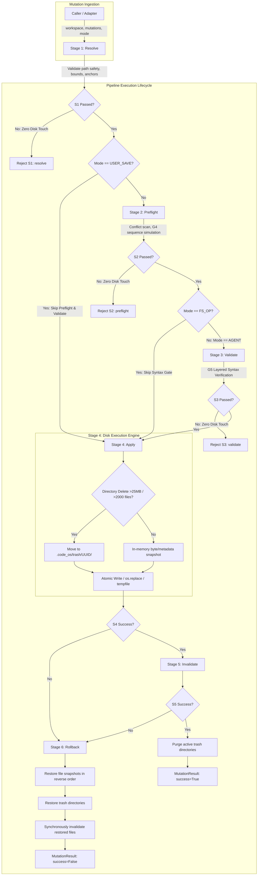

# Unified Mutation Pipeline Architecture (CODE OS v5.0.0 — Phase 12.6)

## Overview

The Unified Mutation Pipeline (`backend/app/features/ai/harness/mutation_pipeline.py`) establishes an atomic, single-path execution engine for all workspace filesystem modifications across CODE OS. Prior to Phase 12.6, workspace writes were scattered across individual feature endpoints, resulting in diverging path-containment policies, uneven syntax checks, split invalidation mechanisms, and disparate error shapes.

The pipeline consolidates all mutations into a strict 6-stage lifecycle:
1. **Stage 1: Resolve (`stage_resolve`)**: Strict workspace containment, traversal prevention, bounds checking, and anchor resolution.
2. **Stage 2: Preflight (`stage_preflight`)**: Multi-edit conflict scanning, directory collision analysis, and mid-sequence simulation.
3. **Stage 3: Validate (`stage_validate`)**: Layered syntax gates adhering to the G5 5-branch contract.
4. **Stage 4: Apply (`stage_apply`)**: Atomic disk write via parent directory temp-file write and `os.replace`, CRLF/BOM preservation, and snapshot management.
5. **Stage 5: Invalidate (`stage_invalidate`)**: Synchronous symbol index invalidation and external cache hooks.
6. **Stage 6: Rollback (`stage_rollback`)**: Complete, in-order exact byte restoration and trash recovery if any error occurs in Stage 4 or Stage 5.

---

## Architecture Flow Diagram

---

## Operating Modes

The pipeline enforces three distinct operational modes tailored to different caller roles:

| Mode | Allowed Mutation Kinds | Anchors / Relocation | Preflight Conflicts | Syntax Gate (S3) | Use Cases |
| :--- | :--- | :--- | :--- | :--- | :--- |
| **`AGENT`** | All (EDIT_RANGE, WRITE_FULL, CREATE, APPEND, DELETE, RENAME_MOVE, COPY, MKDIR) | Enforced (required on 2nd+ patch) | Enforced | Enforced (G5 5-branch contract) | Autonomous agents, proposals, refactoring, security fixes, staging reviews, CI/CD generator, ghost text. |
| **`USER_SAVE`** | WRITE_FULL, CREATE | Ignored (full content replacement) | Skipped | Skipped (records `skipped_user_save`) | Human manual save from Monaco editor (`PUT /api/files/content`). |
| **`FS_OP`** | All kinds | Skipped | Enforced for directory collisions | Skipped | File tree CRUD, global find/replace, staging deletions, turn undo restoration. |

---

## Stage Contracts & Rejection Codes

The pipeline guarantees **zero disk touches** across Stages 1, 2, and 3. If any check fails in Stages 1-3, disk state is completely untouched.

### Complete Rejection Codes Registry

| Stage | Rejection Code | Description | Disk Touch Guarantee |
| :--- | :--- | :--- | :--- |
| **`resolve`** | `path_outside_workspace` | Target path resolves outside workspace root or contains path traversal escape. | **Zero disk touch** |
| **`resolve`** | `protected_path` | Target path attempts to modify or delete workspace root, `.git`, or `.code_os`. | **Zero disk touch** |
| **`resolve`** | `invalid_mode` | Mode is not one of `AGENT`, `USER_SAVE`, or `FS_OP`. | **Zero disk touch** |
| **`resolve`** | `invalid_mutation_kind` | Unsupported mutation kind requested. | **Zero disk touch** |
| **`resolve`** | `path_not_found` | Source file or directory for rename/copy/delete not found. | **Zero disk touch** |
| **`resolve`** | `destination_exists` | Target destination already exists and `overwrite` is False. | **Zero disk touch** |
| **`resolve`** | `cannot_move_into_self` | Attempted to move or copy a directory into its own subpath. | **Zero disk touch** |
| **`resolve`** | `unsupported_encoding` | File is encoded in UTF-16 or contains invalid UTF-8 byte sequences. | **Zero disk touch** |
| **`resolve`** | `disk_read_error` | Failed to read existing target file from disk. | **Zero disk touch** |
| **`resolve`** | `original_must_be_empty` | `original` was provided for a file that does not exist or empty original for existing file. | **Zero disk touch** |
| **`resolve`** | `file_does_not_exist` | Target file for EDIT_RANGE does not exist on disk. | **Zero disk touch** |
| **`resolve`** | `updated_empty_or_equal` | Content provided for EDIT_RANGE is empty or identical to existing. | **Zero disk touch** |
| **`resolve`** | `start_line_out_of_bounds` | Start line is $\le 0$ or exceeds line count. | **Zero disk touch** |
| **`resolve`** | `anchor_too_short` | Anchor is shorter than 40 chars and fewer than 3 lines during relocation. | **Zero disk touch** |
| **`resolve`** | `anchor_not_found` | Anchor could not be found anywhere in file content (drift). | **Zero disk touch** |
| **`resolve`** | `anchor_ambiguous` | Anchor matches multiple distinct locations in the file. | **Zero disk touch** |
| **`resolve`** | `original_mismatches_disk`| Expected original text does not match disk content at specified bounds. | **Zero disk touch** |
| **`preflight`** | `conflicting_mutations` | Multiple mutations target the same path, or directory delete conflicts with mutation inside it. | **Zero disk touch** |
| **`preflight`** | `cannot_move_into_self` | Preflight directory path collision detected. | **Zero disk touch** |
| **`preflight`** | `multi_edit_requires_anchors`| Turn modifies the same file multiple times and a later edit lacks an anchor. | **Zero disk touch** |
| **`preflight`** | `seq_anchor_destroyed` | G4 simulation: earlier patch in sequence destroys a later patch's anchor. | **Zero disk touch** |
| **`preflight`** | `seq_anchor_ambiguous` | G4 simulation: earlier patch causes a later patch's anchor to become ambiguous. | **Zero disk touch** |
| **`preflight`** | `overlapping_edits` | Two patches on the same file overlap or nest bounds. | **Zero disk touch** |
| **`validate`** | `slice_syntax_error` | Patch replacement snippet is syntactically invalid in isolation. | **Zero disk touch** |
| **`validate`** | `projected_syntax_error` | Projected file introduces new syntax errors or conversational prose. | **Zero disk touch** |
| **`apply`** | `apply_failed` | Disk write or atomic replace failed during execution. | **Rolled back** |
| **`apply`** | `trash_move_failed` | Moving large directory to `.code_os/trash/` failed. | **Rolled back** |
| **`invalidate`**| `invalidate_failed` | Symbol index or repo-map cache invalidation raised an exception. | **Rolled back** |
| **`rollback`** | `rollback_failed` | Error occurred while restoring original files/directories during rollback. | Hard failure surfaced |

---

## Mutation Kinds Specification

| Mutation Kind | Permitted Modes | Snapshot Strategy | Invalidation Behavior |
| :--- | :--- | :--- | :--- |
| **`EDIT_RANGE`** | `AGENT`, `FS_OP` | Exact byte snapshot of target file before edit | Invalidates target file path in `symbol_index` and `repo_map` |
| **`WRITE_FULL`** | `AGENT`, `USER_SAVE`, `FS_OP` | Exact byte snapshot (or `None` if new file) | Invalidates target file path |
| **`CREATE`** | `AGENT`, `USER_SAVE`, `FS_OP` | Snapshot recorded as `None` (unlinked on rollback) | Invalidates new file path |
| **`APPEND`** | `AGENT`, `FS_OP` | Exact byte snapshot before append | Invalidates target file path |
| **`DELETE`** | `AGENT`, `FS_OP` | File: byte snapshot. Directory $\le 25\text{ MB} / 2000$ files: in-memory recursive byte map. Directory $> 25\text{ MB} / 2000$ files: moved to `.code_os/trash/UUID/`. | Recursively invalidates all files under deleted directory; triggers external directory cache invalidation hook |
| **`RENAME_MOVE`** | `AGENT`, `FS_OP` | Destination snapshotted if `overwrite=True`. Source moved via `os.replace` (with copy-delete fallback for cross-volume). | Invalidates all paths under both old and new locations; triggers directory cache hook |
| **`COPY`** | `AGENT`, `FS_OP` | Destination snapshotted if overwriting. Partial copies tracked for rollback removal. | Invalidates all copied paths under destination; triggers directory cache hook |
| **`MKDIR`** | `AGENT`, `FS_OP` | Created directories tracked in `apply_state.created_dirs` (pruned on rollback). | Triggers directory cache invalidation hook |

---

## Comprehensive Write-Path Routing Registry

Every workspace write path across the entire backend routes through `apply_mutations`:

| Subsystem / Endpoint | Caller / Adapter | Mode | Pipeline Mutation Kind | Response & Error Shape Mapping |
| :--- | :--- | :--- | :--- | :--- |
| **Agent Proposals** (`POST /api/ai/proposals/apply`) | `app.features.ai.service:apply_proposal` | `AGENT` | `WRITE_FULL` / `EDIT_RANGE` | `ProposalResult(success=True)` or `ProposalResult(success=False, error=msg)` |
| **Chat Agent Edits** (`POST /api/ai/chat-agent/apply`) | `app.features.ai.agent_routes:apply_agent_turn` | `AGENT` | `EDIT_RANGE` / `WRITE_FULL` | `{success: bool, status: str, applied: [...], error: msg}` |
| **Atomic Patch Sequences** | `app.features.ai.harness.patch_applicator:apply_atomic_patch_sequence` | `AGENT` | `EDIT_RANGE` | `(success, error_or_relocs, applied_paths)` |
| **Tool Executor** (`edit_range`, `edit_file`, `write_file`) | `app.features.ai.harness.tool_executor` | `AGENT` | `EDIT_RANGE`, `WRITE_FULL`, `CREATE` | `ToolResult(success=bool, output=str, error=str)` |
| **Stage Finalizer** | `app.features.ai.harness.stage_finalizer:_finalize_staged_changes` | `AGENT` | `WRITE_FULL`, `EDIT_RANGE` | `{success: bool, status: str}` |
| **Monaco User Save** (`PUT /api/files/content`) | `app.features.files.service:save_file_content` | `USER_SAVE`| `WRITE_FULL`, `CREATE` | `{success: True, bytes_written: n}` or HTTP 400/403/500 |
| **File Tree Create** (`POST /api/files/create`) | `app.features.files.service:create_entry` | `FS_OP` | `CREATE`, `MKDIR` | `{success: True, path: p}` or HTTP 400/403/409 |
| **File Tree Delete** (`POST /api/files/delete`) | `app.features.files.service:delete_entry` | `FS_OP` | `DELETE` | `{success: True, path: p}` or HTTP 400/403/404 |
| **File Tree Rename** (`POST /api/files/rename`) | `app.features.files.service:rename_entry` | `FS_OP` | `RENAME_MOVE` | `{success: True, old_path: o, new_path: n}` or HTTP 400/403/404/409 |
| **File Tree Move** (`POST /api/files/move`) | `app.features.files.service:move_entry` | `FS_OP` | `RENAME_MOVE` | `{success: True, path: p}` or HTTP 400/403/404/409 |
| **File Tree Duplicate** (`POST /api/files/duplicate`) | `app.features.files.service:duplicate_entry` | `FS_OP` | `COPY` | `{success: True, path: p}` or HTTP 400/403/404/409 |
| **Global Find/Replace** (`POST /api/search/replace-text`) | `app.features.search.service:replace_text` | `FS_OP` | `WRITE_FULL` | `{success: True, total_replaced: n, files_modified: m, skipped: k, skip_reason: r}` |
| **Staging Review Apply** (`POST /api/ai/staging/apply`) | `app.features.ai.staging.staging_review_service:apply_approved_changes` | `AGENT` | `WRITE_FULL`, `DELETE` | `{success: True, applied_files: [...], rejected_files: [...]}` |
| **Security Scanner Fixes** | `app.features.ai.security.fix_service:apply_fix` | `AGENT` | `WRITE_FULL` | `bool` (`True` on success, `False` on rejection) |
| **Refactoring Suggestions** (`POST /api/ai/refactor/apply`) | `app.features.ai.refactoring.refactor_routes:apply_refactoring_changes` | `AGENT` | `WRITE_FULL` | `{success: True, applied_count: n}` or HTTP 400/500 |
| **Ghost Text Accept** | `app.features.ai.ghost_text.ghost_text_service:accept_ghost_text` | `AGENT` | `WRITE_FULL` | `{status: "accepted"|"applied"|"rejected"}` |
| **CI/CD Pipeline Save** (`POST /api/ai/cicd/save`) | `app.features.ai.cicd.cicd_routes:save_endpoint` | `AGENT` | `WRITE_FULL` | `{success: True}` or HTTP 400/403/500 |
| **Architecture Doc Save** | `app.features.ai.indexing.code_intelligence:save_architecture_doc` | `AGENT` | `WRITE_FULL` | `bool` |
| **Turn Undo Restoration** | `app.features.ai.harness.checkpoint_manager:undo_turn_files` | `FS_OP` | `WRITE_FULL`, `DELETE` | `(success: bool, message: str, restored: list[str])` |

---

## Architectural Decisions & Rationales

1. **`USER_SAVE` Skips Syntax Gate**:
   - *Rationale*: A fail-closed syntax gate on a developer's manual Monaco save would block developers from saving half-finished code, WIP experiments, or temporary syntax errors. `USER_SAVE` preserves path-safety, atomic writes, and invalidation while letting developers save freely.
2. **`FS_OP` Skips Syntax Gate for Structural Ops and Undo**:
   - *Rationale*: Renaming a directory, deleting a folder, running global string find/replace, or undoing a turn must not be blocked if files contain syntax errors. Crucially, git-based turn undo must be capable of restoring an earlier broken state if that is what the prior turn contained.
3. **Two-Tier Directory Delete Snapshot (Memory vs Trash)**:
   - *Rationale*: In-memory byte snapshotting provides instant rollback for small directories ($\le 25\text{ MB}$, $\le 2000$ files). For large trees (e.g. `node_modules`), loading hundreds of megabytes into RAM risks OOM crashes. The pipeline moves large trees to `.code_os/trash/UUID/` within the same filesystem. On commit success, trash is purged. On next startup/call, stale crash trash is automatically cleaned up.
4. **Strict UTF-8 Encoding Contract**:
   - *Rationale*: UTF-16 files (with 16-bit null bytes) cannot be safely sliced or line-edited by standard text tooling. The pipeline rejects UTF-16 files with `unsupported_encoding`. Invalid UTF-8 bytes are rejected fail-closed to prevent silent data corruption. Existing CRLF or LF line endings and UTF-8 BOM are preserved byte-for-byte.
5. **No Silent Overwrites (`destination_exists`)**:
   - *Rationale*: File creation, renaming, and copying refuse to silently overwrite existing files unless `overwrite=True` is explicitly passed.
6. **Proposals Apply in `AGENT` Mode**:
   - *Rationale*: Even though a human approved an agent's proposal card, the generated code must still pass the G5 syntax gate before writing to disk, ensuring hallucinated or truncated code is never committed.
7. **Git as Byte Source of Truth for Undo**:
   - *Rationale*: Rather than computing inverse diffs, `undo_turn_files` extracts exact target bytes directly from the git commit object, then passes `Mutation(kind=WRITE_FULL, raw_bytes=...)` and `Mutation(kind=DELETE)` through the pipeline for atomic application, snapshotting, and symbol invalidation.

---

## Known Limitations

1. **G5 Syntax Counter Approximations**:
   - The syntax error counter in `content_integrity.py` uses AST parsing for Python, but bracket/parenthesis/brace balancing for JS/TS/C/C++. A patch that swaps one syntax error for a different syntax error of the same category while maintaining bracket parity cannot be differentiated without full AST parsers for every language.
2. **Frontend `[SYNTAX_SKIP]` Fallback**:
   - In environments where Node.js or `tsc` is not bundled or executable, TypeScript and JSX syntax checking logs `[SYNTAX_SKIP]` and fails open per the G5 contract.
3. **Conversational Prose Heuristic**:
   - The conversational prose gate uses a keyword/word-frequency heuristic (`_CONVERSATIONAL_WORDS`) that executes only when content lacks JS keywords and code punctuation. Comment-only files and bracket-only structures are explicitly handled, but unusual prose-like code without standard punctuation could theoretically be flagged.
4. **Parent Directory Cleanup in Undo**:
   - `undo_turn_files` in `checkpoint_manager.py` calls `Path.rmdir()` directly to prune empty parent directories after deleting newly created files. This is a non-destructive cleanup outside the pipeline that cannot be rolled back. It is allowlisted and tested.
5. **`safe_write_file` in `core/paths.py`**:
   - `safe_write_file` is an unused helper kept solely because legacy tests (`test_path_containment_hardening.py` and `test_path_traversal_security.py`) import it. It has zero production callers.
6. **Windows Real Symlink Privilege Dependency**:
   - Real-filesystem symlink tests require Windows Developer Mode or elevated privileges. On standard non-elevated developer machines, real symlink creation tests are skipped, while mock-based tests verify branch execution.
7. **Indirect AST Writes Undetectable via Static Scan**:
   - The AST write-drift guard detects direct attribute calls and from-imports, but cannot detect dynamic reflection calls such as `getattr(os, "remove")(...)` or writes performed by external binaries invoked via subprocess.
8. **Cross-Volume Renames**:
   - Cross-volume moves (`EXDEV`) cannot use atomic `os.replace`. The implementation falls back to `shutil.copy2` / `shutil.copytree` followed by source removal, backed by destination snapshotting for complete rollback.
9. **Electron UI Flow**:
   - The live Electron UI flow (amber drift warning banner + non-auto-approving "Re-read and re-confirm" button) is verified via backend state tests and unit tests; interactive human click-through remains **pending manual verification**.
10. **Test Scaffolding in Production Path**:
    - `stage_finalizer.py` retains a `Mock`/`AsyncMock` inspection branch used during test runs, scheduled for refactoring in a future maintenance cycle.
