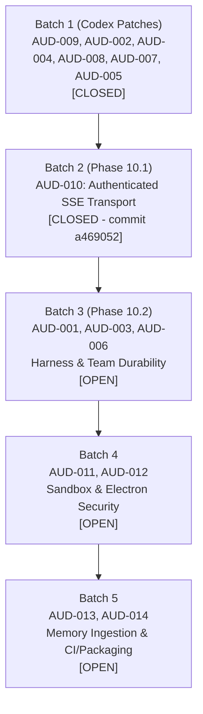

# CODE OS — Phase 9 & 10 Remediation Fix Plan

**Document:** Remediation & Engineering Implementation Roadmap  
**Protocol:** Local git commits only, truth-first verification, full regression suite green before closing any item. Zero remote pushes.

---

## Batch Overview

---

## Batch 1: Codex Core Hardening (COMPLETED)

All 6 patches integrated, verified with focused test suites, and committed locally:

1. **AUD-009 — Windows Terminal Lifecycle**:
   - Target: `backend/app/features/ai/terminal/agentic_terminal_service.py`, `backend/tests/test_agentic_terminal.py`
   - Scope: Bounded Windows process-group termination (`taskkill /T /F`).
   - Commit: `0f1153d` (`fix(terminal): bounded Windows process-group termination (AUD-009)`)
   - Status: **CLOSED**

2. **AUD-002 — Transactional Apply & Rollback**:
   - Target: `backend/app/features/ai/harness/checkpoint_manager.py`, `backend/app/features/ai/harness/stage_finalizer.py`, `backend/tests/test_proposal_integrity.py`
   - Scope: Pre-edit and post-apply SHA-256 hash verification, atomic undo.
   - Commit: `9285055` (`fix(harness): transactional apply/rollback with hash verification (AUD-002)`)
   - Status: **CLOSED**

3. **AUD-004 — Provider-True Tokenization & UTF-8 Fidelity**:
   - Target: `backend/app/features/ai/harness/payload_governor.py`, `backend/app/features/ai/harness/context_assembler.py`, `backend/app/features/ai/chat_harness.py`, `backend/app/features/ai/harness/sse_streamer.py`, `backend/tests/test_payload_governance.py`
   - Scope: Provider-true tokenizer integration via tiktoken; multi-byte UTF-8 boundary preservation in SSE streamer.
   - Commit: `9c98a04` (`fix(harness): provider-true tokenization + UTF-8 byte fidelity (AUD-004)`)
   - Status: **CLOSED**

4. **AUD-008 — Marathon Git Isolation**:
   - Target: `backend/app/features/ai/marathon/marathon_executor.py`, `backend/tests/test_marathon_autopilot.py`
   - Scope: Path-scoped git commits, preventing accidental staging of unrelated user files.
   - Commit: `dece572` (`fix(marathon): path-scoped git commits, no unrelated dirty files (AUD-008)`)
   - Status: **CLOSED**

5. **AUD-007 — RAG Path Containment**:
   - Target: `backend/app/features/ai/rag/rag_routes.py`, `backend/app/features/ai/rag/vector_index_service.py`, `backend/tests/test_semantic_rag.py`
   - Scope: Strict workspace path containment and normalization, blocking directory escapes.
   - Commit: `a2a5ebe` (`fix(rag): strict workspace path containment, reject escapes (AUD-007)`)
   - Status: **CLOSED**

6. **AUD-005 — Tool Result Truthfulness & Breakers**:
   - Target: `backend/app/features/ai/agents/agent_tools.py`, `backend/app/features/ai/harness/tool_executor.py`, `backend/app/features/ai/chat_harness.py`, `backend/tests/test_aud_005_verifier_results.py`
   - Scope: Honest structured test results returned to model; consecutive failure loop breaker integration.
   - Commit: `95e55ab` (`fix(harness): honest test tool results, breaker integration (AUD-005)`)
   - Status: **CLOSED**

---

## Batch 2: Real-Time Stream Transport & Auth (Phase 10.1)

- **AUD-010 — Authenticated SSE Transport**:
  - Target: `backend/app/main.py`, `backend/app/core/auth.py`, `src/lib/sse.ts`, `src/features/ai/console/teamStore.ts`, `src/features/marathon/marathonStore.ts`, `src/features/terminal/agenticTerminalStore.ts`
  - Scope:
    1. Single shared authenticated SSE client helper for frontend stores.
    2. Short-lived single-purpose stream token (`?token=`, TTL <= 60s) scoped strictly to the requested stream route.
    3. Backend `AuthMiddleware` accepts stream tokens ONLY on SSE routes, validates scope and expiration, and rejects missing/invalid/expired tokens with 401.
    4. Automatic reconnection with backoff on drop; unmount cleanup with zero duplicate listeners.
  - Regression Tests:
    - Backend: `test_sse_stream_authorized_via_token`, `test_sse_stream_rejects_missing_invalid_expired_token`
    - Frontend: `test_sse_helper_reconnects_and_cleans_up`, `test_no_eventsource_without_auth_in_stores`
  - Status: **CLOSED** (commit `a469052`: `fix(sse): authenticated stream transport for team/marathon/terminal (AUD-010)`)

---

## Batch 3: Agentic Harness & Team Durability (Phase 10.2)

- **AUD-001 — Duo Loop Semantic Termination Gate**:
  - Target: `backend/app/features/ai/duo/service.py`, `backend/app/features/ai/chat_harness.py`
  - Scope: Semantic convergence checks for Generator-Critic loop.
- **AUD-003 — Context Compaction Fail-Closed Recovery**:
  - Target: `backend/app/features/ai/harness/payload_governor.py`, `backend/app/features/ai/harness/compaction_manager.py`
  - Scope: Fail-closed recovery when payload hopelessly exceeds budget.
- **AUD-006 — Team Mode Task Step Durability**:
  - Target: `backend/app/features/ai/team/orchestrator.py`, `backend/app/features/ai/step_tracker.py`
  - Scope: Write-ahead logging of task step milestones to SQLite for crash resumption.

---

## Batch 4: Sandbox & Electron Isolation Hardening (Phase 10.3)

- **AUD-011 — Mandatory Server-Side Sandbox Policy**:
  - Target: `backend/app/features/ai/sandbox/policy.py`, `backend/app/features/ai/chat_harness.py`
  - Scope: Server-enforced sandbox requirement for untrusted workspaces.
- **AUD-012 — Electron CaptureService Security Lockdown**:
  - Target: `electron/services/captureService.ts`, `electron/main.ts`
  - Scope: Auth token enforcement, localhost-only origin restriction, safe webSecurity settings.

---

## Batch 5: Autonomous Feedback & Packaging Infrastructure (Phase 10.4)

- **AUD-013 — Autonomous Memory Feedback Ingestion**:
  - Target: `backend/app/features/ai/memory/memory_service.py`
  - Scope: Auto-logging lessons from failed tests and rejected diffs into memory.
- **AUD-014 — CI/CD Security Scanning & Release Signing**:
  - Target: `.github/workflows/ci.yml`, `electron-builder.yml`
  - Scope: Mandatory SAST (`bandit`, `pip-audit`, `npm audit`) gates and code signing verification.
