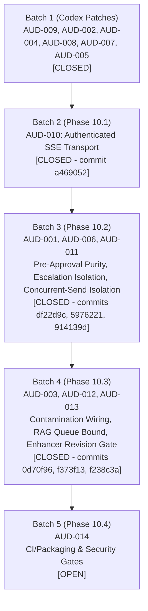

# CODE OS — Phase 9 & 10 Remediation Fix Plan

**Document:** Remediation & Engineering Implementation Roadmap  
**Protocol:** Local git commits only, truth-first verification, full regression suite green before closing any item. Zero remote pushes.

---

## Batch Overview

---

## Batch 1: Codex Core Hardening (COMPLETED)

All 6 patches integrated, verified with focused test suites, and committed locally:

1. **AUD-009 — Windows Terminal Lifecycle**:
   - Target: `backend/app/features/ai/terminal/agentic_terminal_service.py`, `backend/tests/test_agentic_terminal.py`
   - Scope: Bounded Windows process-group termination (`taskkill /T /F`).
   - Commit: `0f1153d` (`fix(terminal): bounded Windows process-group termination (AUD-009)`)
   - Status: **CLOSED**

2. **AUD-002 — Transactional Apply & Rollback**:
   - Target: `backend/app/features/ai/harness/checkpoint_manager.py`, `backend/app/features/ai/harness/stage_finalizer.py`, `backend/tests/test_proposal_integrity.py`
   - Scope: Pre-edit and post-apply SHA-256 hash verification, atomic undo.
   - Commit: `9285055` (`fix(harness): transactional apply/rollback with hash verification (AUD-002)`)
   - Status: **CLOSED**

3. **AUD-004 — Provider-True Tokenization & UTF-8 Fidelity**:
   - Target: `backend/app/features/ai/harness/payload_governor.py`, `backend/app/features/ai/harness/context_assembler.py`, `backend/app/features/ai/chat_harness.py`, `backend/app/features/ai/harness/sse_streamer.py`, `backend/tests/test_payload_governance.py`
   - Scope: Provider-true tokenizer integration via tiktoken; multi-byte UTF-8 boundary preservation in SSE streamer.
   - Commit: `9c98a04` (`fix(harness): provider-true tokenization + UTF-8 byte fidelity (AUD-004)`)
   - Status: **CLOSED**

4. **AUD-008 — Marathon Git Isolation**:
   - Target: `backend/app/features/ai/marathon/marathon_executor.py`, `backend/tests/test_marathon_autopilot.py`
   - Scope: Path-scoped git commits, preventing accidental staging of unrelated user files.
   - Commit: `dece572` (`fix(marathon): path-scoped git commits, no unrelated dirty files (AUD-008)`)
   - Status: **CLOSED**

5. **AUD-007 — RAG Path Containment**:
   - Target: `backend/app/features/ai/rag/rag_routes.py`, `backend/app/features/ai/rag/vector_index_service.py`, `backend/tests/test_semantic_rag.py`
   - Scope: Strict workspace path containment and normalization, blocking directory escapes.
   - Commit: `a2a5ebe` (`fix(rag): strict workspace path containment, reject escapes (AUD-007)`)
   - Status: **CLOSED**

6. **AUD-005 — Tool Result Truthfulness & Breakers**:
   - Target: `backend/app/features/ai/agents/agent_tools.py`, `backend/app/features/ai/harness/tool_executor.py`, `backend/app/features/ai/chat_harness.py`, `backend/tests/test_aud_005_verifier_results.py`
   - Scope: Honest structured test results returned to model; consecutive failure loop breaker integration.
   - Commit: `95e55ab` (`fix(harness): honest test tool results, breaker integration (AUD-005)`)
   - Status: **CLOSED**

---

## Batch 2: Real-Time Stream Transport & Auth (Phase 10.1)

- **AUD-010 — Authenticated SSE Transport**:
  - Target: `backend/app/main.py`, `backend/app/core/auth.py`, `src/lib/sse.ts`, `src/features/ai/console/teamStore.ts`, `src/features/marathon/marathonStore.ts`, `src/features/terminal/agenticTerminalStore.ts`
  - Scope:
    1. Single shared authenticated SSE client helper for frontend stores.
    2. Short-lived single-purpose stream token (`?token=`, TTL <= 60s) scoped strictly to the requested stream route.
    3. Backend `AuthMiddleware` accepts stream tokens ONLY on SSE routes, validates scope and expiration, and rejects missing/invalid/expired tokens with 401.
    4. Automatic reconnection with backoff on drop; unmount cleanup with zero duplicate listeners.
  - Regression Tests:
    - Backend: `test_sse_stream_authorized_via_token`, `test_sse_stream_rejects_missing_invalid_expired_token`
    - Frontend: `test_sse_helper_reconnects_and_cleans_up`, `test_no_eventsource_without_auth_in_stores`
  - Status: **CLOSED** (commit `a469052`: `fix(sse): authenticated stream transport for team/marathon/terminal (AUD-010)`)

---

## Batch 3: Pre-Approval Purity, Escalation Isolation, Concurrent-Send Isolation (Phase 10.2)

- **AUD-001 — Pre-Approval Filesystem Mutation**:
  - Target: `backend/app/features/ai/chat_harness.py`, `backend/tests/test_aud_001_006_011.py`
  - Scope: Removed `mkdir(parents=True)` from the staging path in `chat_harness.py`. Parent directories are now only created inside the approved `apply_proposal`/`write_file` transaction. On rejection or timeout, no directories are created.
  - Regression Tests: `test_nested_new_file_reject_leaves_no_directories`, `test_nested_new_file_timeout_leaves_no_directories`
  - Commit: `df22d9c` (`fix(staging): remove pre-approval mkdir during file staging (AUD-001)`)
  - Status: **CLOSED**

- **AUD-006 — Escalation Resolver Fuzzy Matching**:
  - Target: `backend/app/features/ai/harness/approval_coordinator.py`, `backend/app/features/ai/chat_harness_routes.py`, `backend/app/features/ai/team/team_routes.py`
  - Scope: `resolve_escalation` now requires an exact `action_id`. Workspace substring, task substring, and "most recent pending" fallbacks removed. The `/escalation-decision` endpoint returns 404 when `action_id` is missing or not found. The redundant `resolve_escalation` call in `team_routes.py` (which used no action_id) was removed.
  - Regression Tests: `test_escalation_resolution_requires_exact_action_id`, `test_concurrent_escalations_resolve_independently`, `test_stale_handoff_id_rejected`, `test_workspace_substring_fallback_removed`, `test_task_substring_fallback_removed`, `test_most_recent_pending_fallback_removed`
  - Commit: `5976221` (`fix(escalation): exact action_id required for all resolution paths (AUD-006)`)
  - Status: **CLOSED**

- **AUD-011 — Concurrent-Send Turn Isolation**:
  - Target: `src/stores/aiStore.ts`, `src/__tests__/aud_011_concurrent_sends.test.ts`
  - Scope: Single-active-send queue. When a second `sendMessage` arrives while streaming is active, the current run's `AbortController` is aborted and a tick is yielded before the new run starts. Each run captures its own `thisController` reference; the `finally` block only clears streaming state when `activeController === thisController` — a stale finalizer from an aborted run cannot clear a newer run's state.
  - Regression Tests: `test_concurrent_sends_isolated_content`, `test_stale_finalizer_cannot_clear_newer_run`
  - Commit: `914139d` (`fix(chat): single-active-send queue isolates concurrent sends (AUD-011)`)
  - Status: **CLOSED**

---

## Batch 4: Contamination Wiring, RAG Queue Bound, Enhancer Revision Gate (Phase 10.3)

- **AUD-003 — Proposal Integrity Contamination Gate Unwired**:
  - Target: `backend/app/features/ai/harness/content_integrity.py`, `backend/app/features/ai/harness/stage_finalizer.py`, `backend/app/features/ai/chat_harness.py`, `backend/tests/test_aud_003_012.py`
  - Scope: Bounded provenance-separated history snapshot (last N assistant messages and tool prose) passed from `chat_harness.py` through `stage_finalizer.py` into `validate_content_integrity`. The contamination detector strictly checks assistant prose while ignoring user instructions and standard code. Proposals containing copied prior assistant prose are blocked.
  - Regression Tests: `test_contamination_gate_blocks_copied_prose_in_live_flow`, `test_ordinary_source_repetition_not_blocked`, `test_check_cross_turn_contamination_provenance_filter`
  - Commit: `0d70f96` (`fix(harness): wire live history into contamination integrity gate (AUD-003)`)
  - Status: **CLOSED**

- **AUD-012 — Semantic RAG Reindex Queue Boundedness & Eviction**:
  - Target: `backend/app/features/ai/rag/vector_index_service.py`, `backend/app/features/ai/rag/__init__.py`, `backend/tests/test_aud_003_012.py`
  - Scope: Replaced unbounded `asyncio.Queue` with per-path coalesced dictionary (`_pending_reindex`) using last-event-wins semantics, bounded capacity (`MAX_REINDEX_QUEUE_SIZE = 1000` with oldest-event eviction), and lifecycle cancellation support (`cancel_rag_reindex`, `get_rag_reindex_queue_size`).
  - Regression Tests: `test_rag_queue_bounded_under_burst`, `test_rag_queue_lifecycle_cancellation`
  - Commit: `f373f13` (`fix(rag): bounded last-event-wins reindex queue with cancellation (AUD-012)`)
  - Status: **CLOSED**

- **AUD-013 — Prompt Enhancer Classification Race / Stale Response**:
  - Target: `src/stores/intelligenceStore.ts`, `src/__tests__/aud_013_enhancer_stale_response.test.ts`
  - Scope: Monotonically increasing revision sequence counter (`currentClassifyRevision`) and `AbortController` gate (`classifyAbortController`). In-flight classification requests are aborted on subsequent input changes, and late/out-of-order responses from superseded revisions are discarded before mutating state.
  - Regression Tests: `test_enhancer_stale_response_discarded`, `test_empty_input_cancels_and_discards_in_flight_classification`
  - Commit: `f238c3a` (`fix(intelligence): revision ID and abort gate for prompt enhancer (AUD-013)`)
  - Status: **CLOSED**

---

## Batch 5: Autonomous Feedback & Packaging Infrastructure (Phase 10.4)

- **AUD-014 — CI/CD Security Scanning & Release Signing**:
  - Target: `.github/workflows/ci.yml`, `electron-builder.yml`
  - Scope: Mandatory SAST (`bandit`, `pip-audit`, `npm audit`) gates and code signing verification.
  - Status: **OPEN**
